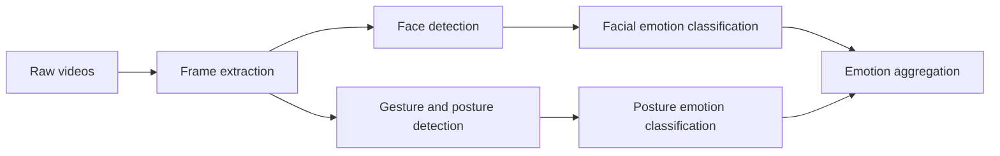

# The Data Mine 2025/2026 Congressional Rhetoric

## Video team

This repository contains the code and resources for the video team working on the Data Mine 2025/2026 Congressional Rhetoric project. The team is responsible for analyzing speeches from members of the congress to find out whether the sentiment is positive, negative or neutral.

## High-level overview

## Documentation

### Preprocessing

Right now it is a simple script that takes every 5th frame from the videos.
