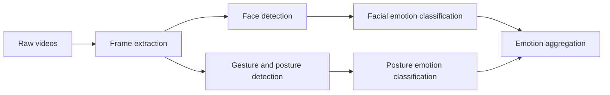

# The Data Mine 2025/2026 Congressional Rhetoric

## Video team

This repository contains the code and resources for the video team working on the Data Mine 2025/2026 Congressional Rhetoric project. The team is responsible for analyzing speeches from members of the congress to find out whether the sentiment is positive, negative or neutral.

## High-level overview



## Documentation

### Running the code

It is a good practice to use a virtual environment. You can create one using:

```bash
python -m venv .venv
source .venv/bin/activate  # On Windows use `.venv\Scripts\activate`
```

Then install the required packages:

```bash
pip install -r requirements.txt
```

To run the preprocessing script, use:

```bash
python video_preprocessing.py
```

### Preprocessing

The preprocessing script extracts frames from videos, detects faces, and saves the processed data for further analysis. You can customize the parameters such as frame rate, face detection size, and margin. The code works operates through the following cli:

```properties
python video_preprocessing.py -h
usage: video_preprocessing.py [-h] [--data_dir DATA_DIR] [--label_file LABEL_FILE] [--out_dir OUT_DIR] [--frame_skip FRAME_SKIP] [--size SIZE]
                              [--detection_size DETECTION_SIZE] [--margin MARGIN] [--purge]

Process videos to extract face tensors.

options:
  -h, --help            show this help message and exit
  --data_dir DATA_DIR   Path to the directory containing video files.
  --label_file LABEL_FILE
                        Path to the CSV file containing video labels.
  --out_dir OUT_DIR     Path to the directory where output tensors will be saved.
  --frame_skip FRAME_SKIP
                        Save only every N-th frame.
  --size SIZE           Target size for face tensors.
  --detection_size DETECTION_SIZE
                        Size for face detection.
  --margin MARGIN       Margin to add around detected faces.
  --purge               Purge existing output files before processing.
```

## Sources

- [YuNet model from OpenCV](https://github.com/opencv/opencv_zoo/blob/main/models/face_detection_yunet/face_detection_yunet_2023mar.onnx)
