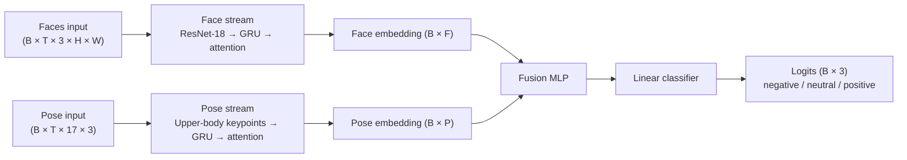
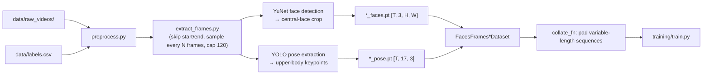

# The Data Mine 2025/2026 Congressional Rhetoric - Video Team

[](https://www.python.org/downloads/)
[](https://github.com/MeasureZer0/f2025_s2026_wl_cspan_congressionalrhetoric_video/actions/workflows/pyright.yml)
[](https://github.com/MeasureZer0/f2025_s2026_wl_cspan_congressionalrhetoric_video/actions/workflows/ruff.yml)

This repository contains the code and resources for the video team working on the Data Mine 2025/2026 Congressional Rhetoric project. The team is responsible for analyzing speeches from members of the congress to find out whether the sentiment is positive, negative or neutral.

---
 
## Table of Contents
 
- [Architecture](#architecture)
- [Data Pipeline](#data-pipeline)
- [Quick Start](#quick-start)
- [Training](#training)
- [Utility Scripts](#utility-scripts)
- [Project Layout](#project-layout)
- [References](#references)

---

## Architecture



- The model has two parallel streams: one for face frames, one for pose keypoints.
- The face stream uses a CNN backbone (`ResNet18`) to encode each frame, then a GRU to model time.
- The pose stream uses keypoint sequences (`17 x 3`) and a GRU to model motion/body dynamics.
- Both streams apply temporal attention to summarize variable-length sequences into fixed-size embeddings.
- Face and pose embeddings are concatenated and passed through a fusion MLP.
- A final classifier predicts one of 3 sentiment classes per video clip.

Two encoder variants are available:
 
| Encoder | Streams | When to use |
|---------|---------|-------------|
| `dual_stream` *(default)* | face + pose | Best accuracy |
| `fast_gru` | face only | Faster training / no pose data |

Key files:

- [training/train.py](training/train.py) - CLI entrypoint for SSL and supervised training
- [training/models.py](training/models.py) - encoder and fusion model definitions

- [training/faces_frames_dataset.py](training/faces_frames_dataset.py) - datasets loading `*_faces.pt` and `*_pose.pt`

## Data Pipeline



**Per-video steps:**
 
1. Sample every `frame_skip` frames; skip up to 5 s at each end.
2. Keep at most 120 frames.
3. Centre-crop each frame to `crop_width_ratio` of its width.
4. Detect faces with YuNet; select the most central one.
5. Extract upper-body pose keypoints with YOLOv8-pose.
6. Save `<stem>_faces.pt` and `<stem>_pose.pt` to `data/processed/frame_skip_<N>/`.
**Required weights** (downloaded by `scripts/download-weights.py`):
 
| File | Used by |
|------|---------|
| `data/weights/face_detection_yunet_2023mar.onnx` | `preprocessing/crop_faces.py` |
| `data/weights/yolo26m-pose.pt` | `preprocessing/extract_pose.py` |

## Quick Start

```bash
git clone https://github.com/MeasureZer0/cspan_congressionalrhetoric_video.git video
cd video
 
# Create and activate virtual environment
uv venv
source .venv/bin/activate   # Windows: .venv\Scripts\activate
 
# Install dependencies
uv sync
 
# Download model weights (YuNet face detector + YOLO pose)
python scripts/download-weights.py
 
# Preprocess videos
python preprocessing/preprocess.py --purge --frame-skip 30
 
# SSL pre-training (optional but recommended)
python -m training.train --mode ssl --encoder dual_stream --epochs 10 --batch-size 8
 
# Supervised training
python -m training.train --mode supervised --encoder dual_stream --epochs 20 --batch-size 8
```
 
---

### Preprocessing

```bash
-> python preprocessing/preprocess.py -h
usage: preprocess.py [-h] [--data-dir DATA_DIR] [--label-file LABEL_FILE]
                     [--out-dir OUT_DIR] [--frame-skip FRAME_SKIP]
                     [--size SIZE SIZE] [--margin MARGIN]
                     [--crop-width-ratio CROP_WIDTH_RATIO] [--purge]
                     [--max-workers MAX_WORKERS]

Process videos to extract face and pose tensors.

options:
  -h, --help            show this help message and exit
  --data-dir DATA_DIR
  --label-file LABEL_FILE
  --out-dir OUT_DIR
  --frame-skip FRAME_SKIP
  --size SIZE SIZE      Target size for face tensors (height width).
  --margin MARGIN
  --crop-width-ratio CROP_WIDTH_RATIO
  --purge
  --max-workers MAX_WORKERS
```

### Training

```bash
-> python -m training.train -h
usage: train.py [-h] --mode {ssl,supervised}
                [--encoder {fast_gru,dual_stream}] [--epochs EPOCHS]
                [--num-workers NUM_WORKERS] [--batch-size BATCH_SIZE]
                [--load-ssl] [--frame-skip FRAME_SKIP] [--subset SUBSET]
                [--temperature TEMPERATURE] [--freeze-backbone]
                [--aug-multiplier AUG_MULTIPLIER]

options:
  -h, --help            show this help message and exit
  --mode {ssl,supervised}
  --encoder {fast_gru,dual_stream}
  --epochs EPOCHS
  --num-workers NUM_WORKERS
  --batch-size BATCH_SIZE
  --load-ssl
  --frame-skip FRAME_SKIP
  --subset SUBSET
  --temperature TEMPERATURE
  --freeze-backbone     Freeze ResNet backbone
  --aug-multiplier AUG_MULTIPLIER
                        How many augmented copies of each train sample per epoch
```
## Utility Scripts
 
See [`scripts/README.md`](scripts/README.md) for full documentation.
 
| Script | Purpose |
|--------|---------|
| `scripts/download-weights.py` | Download YuNet and YOLO weights |
| `scripts/label-videos.py` | Interactive Tk+VLC video labeling tool |
| `scripts/move-random-videos.py` | Move/copy a random subset of videos between directories |
| `scripts/pip-uninstall.py` | Uninstall a package and its orphaned dependencies |
| `visualization/peek_faces.py` | Preview face tensors as an image grid |
 
---

## Project Layout
 
```
.
├── preprocessing/
│   ├── config.py           # PreprocessingConfig, FaceDetectionConfig
│   ├── preprocess.py       # CLI entry point
│   ├── extract_frames.py   # Frame sampling
│   ├── crop_faces.py       # Face detection + cropping
│   └── extract_pose.py     # YOLO pose extraction
├── training/
│   ├── train.py            # CLI entry point
│   ├── models.py           # FastGRU, PoseGRU, DualStreamEncoder, SimCLRProjectionWrapper
│   ├── encoder.py          # build_encoder helper
│   ├── faces_frames_dataset.py  # Dataset classes + SimCLRDataset
│   ├── ssl.py              # SimCLR pre-training loop
│   ├── supervised.py       # Supervised training + test evaluation
│   ├── losses.py           # NTXentLoss
│   ├── memory_bank.py      # MemoryBank
│   ├── optimizer.py        # build_optimizer
│   ├── transforms.py       # VideoSimCLRTransform
│   ├── pose_transforms.py  # PoseSimCLRTransform
│   └── utils.py            # Collate functions, EarlyStopping, seeds
├── visualization/
│   └── peek_faces.py
├── scripts/
│   ├── download-weights.py
│   ├── label-videos.py
│   ├── move-random-videos.py
│   └── pip-uninstall.py
├── sbatch/
│   ├── preprocessing.sh    # Anvil job script
│   └── training.sh
└── utils/
    └── timer.py
```
 
---

## References

- Simonyan & Zisserman, [Two-Stream Convolutional Networks for Action Recognition in Videos](https://arxiv.org/pdf/1406.2199), NeurIPS 2014.
- Ng et al., [Beyond Short Snippets: Deep Networks for Video Classification](https://arxiv.org/pdf/1503.08909), CVPR 2015.
- Chen et al., [A Simple Framework for Contrastive Learning of Visual Representations](https://arxiv.org/pdf/2002.05709), ICML 2020.
- [YuNet face detector — OpenCV Zoo](https://github.com/opencv/opencv_zoo/blob/main/models/face_detection_yunet/)
- [Ultralytics YOLO Pose](https://docs.ultralytics.com/tasks/pose/)
