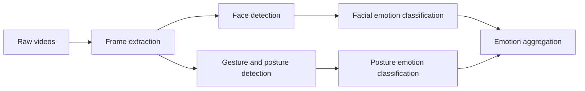

# The Data Mine 2025/2026 Congressional Rhetoric

## Video team

This repository contains the code and resources for the video team working on the Data Mine 2025/2026 Congressional Rhetoric project. The team is responsible for analyzing speeches from members of the congress to find out whether the sentiment is positive, negative or neutral.

## High-level overview



## Documentation

### Running the code

It is a good practice to use a virtual environment. You can create one using:

```bash
python -m venv .venv
source .venv/bin/activate  # On Windows use `.venv\Scripts\activate`
```

Then install the required packages:

```bash
pip install -r requirements.txt
```

To run the preprocessing script, use:

```bash
python video_preprocessing.py
```

### Preprocessing

Right now it is a simple script that takes every 5th frame from the videos.
