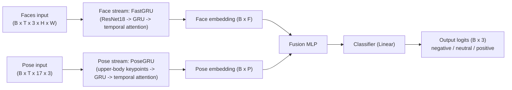
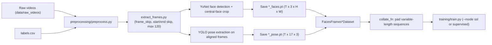

# The Data Mine 2025/2026 Congressional Rhetoric - Video Team

[](https://www.python.org/downloads/)
[](https://github.com/MeasureZer0/f2025_s2026_wl_cspan_congressionalrhetoric_video/actions/workflows/pyright.yml)
[](https://github.com/MeasureZer0/f2025_s2026_wl_cspan_congressionalrhetoric_video/actions/workflows/ruff.yml)

This repository contains the code and resources for the video team working on the Data Mine 2025/2026 Congressional Rhetoric project. The team is responsible for analyzing speeches from members of the congress to find out whether the sentiment is positive, negative or neutral.

## Model architecture



- The model has two parallel streams: one for face frames, one for pose keypoints.
- The face stream uses a CNN backbone (`ResNet18`) to encode each frame, then a GRU to model time.
- The pose stream uses keypoint sequences (`17 x 3`) and a GRU to model motion/body dynamics.
- Both streams apply temporal attention to summarize variable-length sequences into fixed-size embeddings.
- Face and pose embeddings are concatenated and passed through a fusion MLP.
- A final classifier predicts one of 3 sentiment classes per video clip.

You can train two encoder variants:

- `dual_stream` (default): face + pose
- `fast_gru`: face-only stream

Key files:

- [training/train.py](training/train.py) - CLI entrypoint for SSL and supervised training
- [training/models.py](training/models.py) - encoder and fusion model definitions

- [training/faces_frames_dataset.py](training/faces_frames_dataset.py) - datasets loading `*_faces.pt` and `*_pose.pt`

## Data pipeline (detailed)



Short explanation:

- Preprocessing extracts frames, detects/crops the main face, and extracts per-frame pose keypoints.

- Outputs are saved as two tensors per video stem: `*_faces.pt` and `*_pose.pt`.

- Training datasets load both tensors, align sequence lengths, and pad batches with custom collate functions.

Important notes:

- `preprocessing/extract_pose.py` requires `data/weights/yolo26m-pose.pt`.
- `scripts/download-weights.py` currently downloads only YuNet (`face_detection_yunet_2023mar.onnx`).
- `training/train.py` must be run as a module: `python -m training.train ...`.

## Running the code

```bash
git clone https://github.com/MeasureZer0/cspan_congressionalrhetoric_video.git video
cd video
```

It is a good practice to use a virtual environment. You can create one using:

```bash
uv venv
source .venv/bin/activate  # On Windows use `.venv\Scripts\activate`
```

Then install the required packages:

```bash
uv sync
```

Download required weights (they will be saved to `data/weights/`):

```bash
python scripts/download-weights.py
```

Run preprocessing:

```bash
python preprocessing/preprocess.py --purge --frame-skip 30
```

Run SSL pretraining:

```bash
python -m training.train --mode ssl --encoder dual_stream --epochs 10 --batch-size 8
```

Run supervised training:

```bash
python -m training.train --mode supervised --encoder dual_stream --epochs 20 --batch-size 8
```

Below you can find the full arguments list.

### Preprocessing

```bash
❯ python preprocessing/preprocess.py -h
usage: preprocess.py [-h] [--data-dir DATA_DIR] [--label-file LABEL_FILE]
                     [--out-dir OUT_DIR] [--frame-skip FRAME_SKIP]
                     [--size SIZE SIZE] [--margin MARGIN]
                     [--crop-width-ratio CROP_WIDTH_RATIO] [--purge]
                     [--max-workers MAX_WORKERS]

Process videos to extract face and pose tensors.

options:
  -h, --help            show this help message and exit
  --data-dir DATA_DIR
  --label-file LABEL_FILE
  --out-dir OUT_DIR
  --frame-skip FRAME_SKIP
  --size SIZE SIZE      Target size for face tensors (height width).
  --margin MARGIN
  --crop-width-ratio CROP_WIDTH_RATIO
  --purge
  --max-workers MAX_WORKERS
```

### Training

```bash
❯ python -m training.train -h
usage: train.py [-h] --mode {ssl,supervised}
                [--encoder {fast_gru,dual_stream}] [--epochs EPOCHS]
                [--num-workers NUM_WORKERS] [--batch-size BATCH_SIZE]
                [--load-ssl] [--frame-skip FRAME_SKIP] [--subset SUBSET]
                [--temperature TEMPERATURE] [--freeze-backbone]
                [--aug-multiplier AUG_MULTIPLIER]

options:
  -h, --help            show this help message and exit
  --mode {ssl,supervised}
  --encoder {fast_gru,dual_stream}
  --epochs EPOCHS
  --num-workers NUM_WORKERS
  --batch-size BATCH_SIZE
  --load-ssl
  --frame-skip FRAME_SKIP
  --subset SUBSET
  --temperature TEMPERATURE
  --freeze-backbone     Freeze ResNet backbone
  --aug-multiplier AUG_MULTIPLIER
                        How many augmented copies of each train sample per epoch
```

## Utility scripts

You can find utility scripts in the `scripts/` directory. More info on the available scripts and how to use them can be found in the [scripts/README.md](./scripts/README.md) file.

## Sources

- [YuNet model from OpenCV](https://github.com/opencv/opencv_zoo/blob/main/models/face_detection_yunet/face_detection_yunet_2023mar.onnx)
- [Ultralytics YOLO Pose docs](https://docs.ultralytics.com/tasks/pose/)
- Karen Simonyan, Andrew Zisserman, __Two-Stream Convolutional Networks for Action Recognition in Videos__, [https://arxiv.org/pdf/1406.2199](https://arxiv.org/pdf/1406.2199), 2014.
- Joe Yue-Hei Ng, Matthew Hausknecht, Sudheendra Vijayanarasimhan, Rajat Monga, Oriol Vinyals, George Toderici, __Beyond Short Snippets: Deep Networks for Video Classification__, [https://arxiv.org/pdf/1503.08909](https://arxiv.org/pdf/1503.08909), 2015.
- Ting Chen, Simon Kornblith, Mohammad Norouzi, Geoffrey Hinton, __A Simple Framework for Contrastive Learning of Visual Representations__, [https://arxiv.org/pdf/2002.05709](https://arxiv.org/pdf/2002.05709), 2020.
