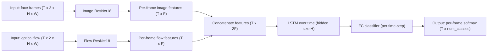
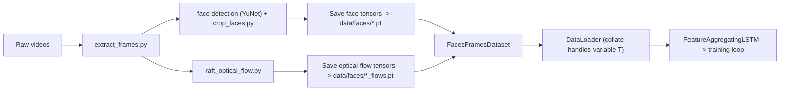

# The Data Mine 2025/2026 Congressional Rhetoric - Video Team

[](https://www.python.org/downloads/)

This repository contains the code and resources for the video team working on the Data Mine 2025/2026 Congressional Rhetoric project. The team is responsible for analyzing speeches from members of the congress to find out whether the sentiment is positive, negative or neutral.

## Model architecture



This project uses a hybrid CNN+LSTM architecture. Each frame and its corresponding optical-flow tensor are passed through separate ResNet18-based feature extractors (frames use 3 input channels; flow uses 2). Per-frame features are concatenated and fed into an LSTM which produces per-time-step logits; a final linear layer maps LSTM outputs to the target classes (positive/neutral/negative).

Key files:

- [training/train.py](training/train.py) — model definition and training loop (FeatureAggregatingLSTM).

- [training/faces_frames_dataset.py](training/faces_frames_dataset.py) — dataset that loads sequences of face tensors and flows.

## Data pipeline (detailed)



Short explanation:

- Preprocessing extracts frames, detects faces with the YuNet model and crops/resizes them into tensors (see [crop_faces.py](./preprocessing/crop_faces.py) and [extract_frames.py](./preprocessing/extract_frames.py)).

- Optical flow is computed per video (see [raft_optical_flow.py](./preprocessing/raft_optical_flow.py)) and stored alongside face tensors.

- At training time `FacesFramesDataset` loads matching sequences of face tensors and flows; the custom `collate_fn` pads variable-length sequences and supplies lengths so the LSTM can skip padding via packed sequences.

Important notes:

- The model produces per-frame predictions; [training/train.py](./training/train.py) implements masked loss/accuracy to ignore padded frames.

- We store model weights under `data/weights` by default; download helper scripts live in `scripts/`.

## Running the code

```bash
git clone https://github.com/MeasureZer0/f2025_s2026_wl_cspan_congressionalrhetoric_video.git video
cd video
```

It is a good practice to use a virtual environment. You can create one using:

```bash
python -m venv .venv
source .venv/bin/activate  # On Windows use `.venv\Scripts\activate`
```

Then install the required packages:

```bash
pip install -r requirements.txt
```

Then run the scripts:

```bash
python preprocessing/crop_faces.py --purge

python training/train.py --epochs 10 --batch-size 2
```

Below you can find the full arguments list.

### Preprocessing

```bash
❯ python preprocessing/crop_faces.py -h
usage: crop_faces.py [-h] [--data_dir DATA_DIR] [--label_file LABEL_FILE] [--out_dir OUT_DIR] [--frame_skip FRAME_SKIP] [--size SIZE] [--margin MARGIN]
                     [--purge]

Process videos to extract face tensors.

options:
  -h, --help            show this help message and exit
  --data_dir DATA_DIR   Path to the directory containing video files.
  --label_file LABEL_FILE
                        Path to the CSV file containing video labels.
  --out_dir OUT_DIR     Path to the directory where output tensors will be saved.
  --frame_skip FRAME_SKIP
                        Save only every N-th frame.
  --size SIZE           Target size for face tensors.
  --margin MARGIN       Margin to add around detected faces.
  --purge               Purge existing output files before processing.
```

### Training

```bash
❯ python training/train.py -h
usage: train.py [-h] [--epochs EPOCHS] [--batch-size BATCH_SIZE]

Train the video classification model.

options:
  -h, --help            show this help message and exit
  --epochs EPOCHS       Number of training epochs.
  --batch-size BATCH_SIZE
                        Batch size for training.
```

## Utilities

### download-weights.py

The `download-weights.py` script downloads the required model weights for the project. It saves the weights in the `data/weights` directory. To run the script, use:

```bash
chmod +x scripts/download-weights.py
./scripts/download-weights.py
```

### pip-uninstall.py

For easier package uninstallation, you can use the provided `pip-uninstall.py` script. It helps to uninstall packages along with their dependencies that are not required by other packages. Usage:

```bash
chmod +x scripts/pip-uninstall.py
./scripts/pip-uninstall.py pkg1 pkg2 ...
```

## Sources

- [YuNet model from OpenCV](https://github.com/opencv/opencv_zoo/blob/main/models/face_detection_yunet/face_detection_yunet_2023mar.onnx)
- Karen Simonyan, Andrew Zisserman, __Two-Stream Convolutional Networks for Action Recognition in Videos__, [https://arxiv.org/pdf/1406.2199](https://arxiv.org/pdf/1406.2199), 2014.
- Joe Yue-Hei Ng, Matthew Hausknecht, Sudheendra Vijayanarasimhan, Rajat Monga, Oriol Vinyals, George Toderici, __Beyond Short Snippets: Deep Networks for Video Classification__, [https://arxiv.org/pdf/1503.08909](https://arxiv.org/pdf/1503.08909), 2015.
