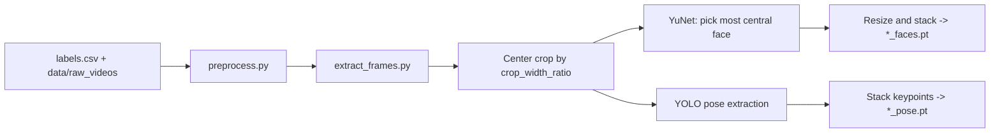

# Video Preprocessing Pipeline

This module converts raw videos into aligned face and pose tensors used by training.

## Quick Start

```bash
python preprocessing/preprocess.py --purge --frame-skip 30
```

## Flow



## What Happens Per Video

1. Frames are sampled every `frame_skip` frames.
2. Start and end portions of each video are skipped (up to 5 seconds each side).
3. At most 120 sampled frames are kept.
4. Each sampled frame is center-cropped by `crop_width_ratio`.
5. YuNet detects faces; the most central face is selected, cropped, margin-expanded, resized.
6. Pose keypoints are extracted from the same aligned frames.
7. Two tensors are saved: `*_faces.pt` and `*_pose.pt`.

Videos with no extracted frames or no detected faces are skipped.

## Configuration

### `PreprocessingConfig` (`config.py`)

- Paths: `data_dir`, `label_file`, `out_dir`
- Processing: `frame_skip`, `size`, `margin`, `crop_width_ratio`
- Execution: `purge`, `max_workers`

Defaults:

- `data_dir`: `data/raw_videos`
- `label_file`: `data/labels.csv`
- `out_dir`: `data/processed/frame_skip_<frame_skip>`
- `size`: `(128, 128)`
- `frame_skip`: `30`

### `FaceDetectionConfig` (`config.py`)

- `model_path`: `data/weights/face_detection_yunet_2023mar.onnx`
- `input_size`: `(768, 576)`
- `score_threshold`: `0.9`
- `nms_threshold`: `0.3`
- `top_k`: `5000`

## CLI Arguments

```bash
python preprocessing/preprocess.py -h
```

- `--data-dir PATH`
- `--label-file PATH`
- `--out-dir PATH`
- `--frame-skip INT`
- `--size H W`
- `--margin FLOAT`
- `--crop-width-ratio FLOAT`
- `--purge`
- `--max-workers INT`

## Output Structure

```
data/processed/frame_skip_30/
├── <video_stem>_faces.pt
├── <video_stem>_pose.pt
└── ...
```

- `*_faces.pt`: tensor shape `[T, 3, H, W]`
- `*_pose.pt`: tensor shape `[T, 17, 3]` (`x_norm`, `y_norm`, `confidence`)

## Requirements

- YuNet weights: `data/weights/face_detection_yunet_2023mar.onnx`
- Pose weights: `data/weights/yolo26m-pose.pt`
- Python package: `ultralytics` (used by `extract_pose.py`)

## Module Structure

```
preprocessing/
├── config.py
├── preprocess.py
├── crop_faces.py
├── extract_frames.py
├── extract_pose.py
└── README.md
```
